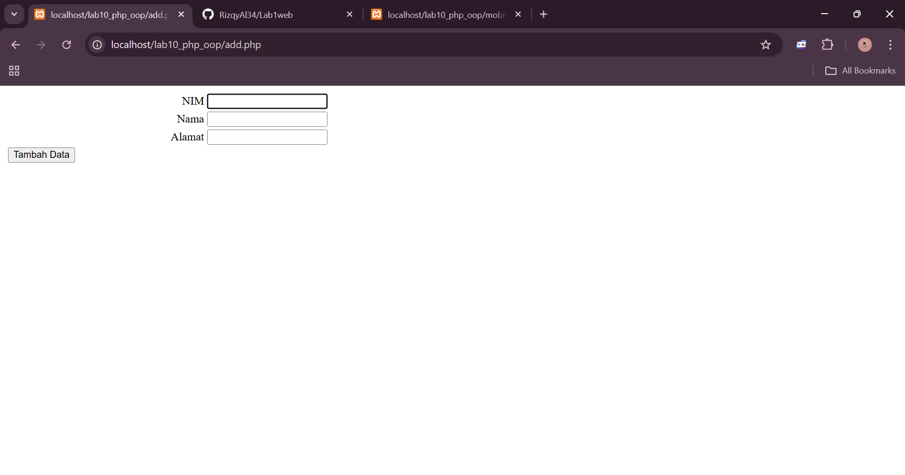
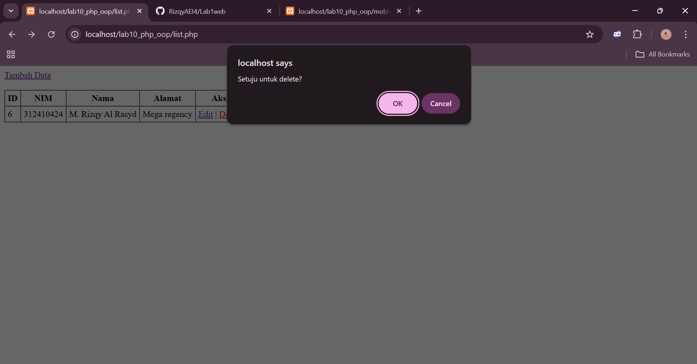
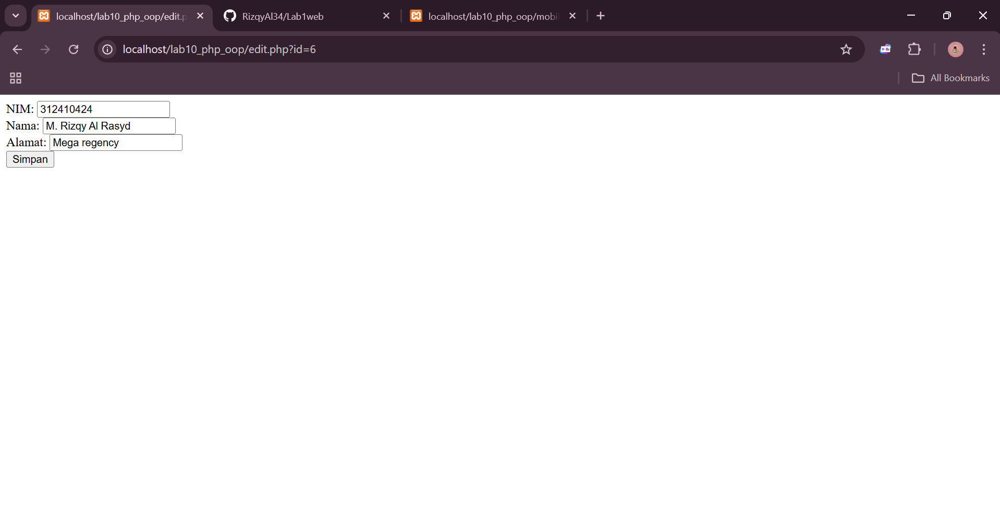
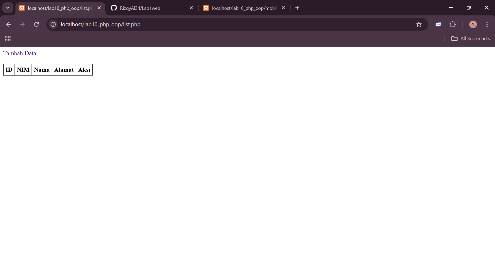
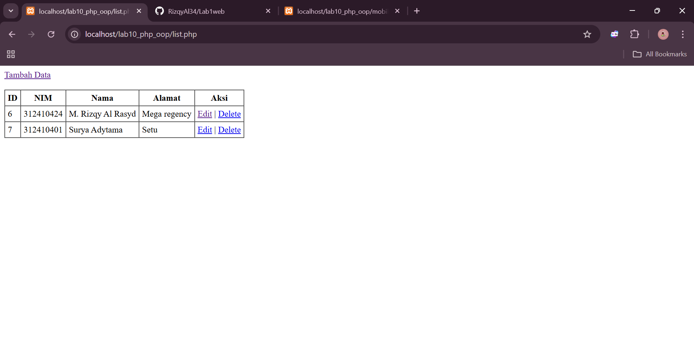

# lab10web
```
Nama  : M. Rizqy Al Rasyd
Nim   : 312410424
Kelas : TI.24.A3
```
## Program sederhana definisi class
Code:
```
<?php
class Mobil
{
    private $warna;
    private $merk;
    private $harga;
    
    public function __construct()
    {
        $this->warna = "Biru";
        $this->merk = "BMW";
        $this->harga = "10000000";
    }

    public function gantiWarna ($warnaBaru)
    {
        $this->warna = $warnaBaru;
    }

    public function tampilWarna ()
    {
        echo "Warna mobilnya : " . $this->warna;
    }
}
$a = new Mobil();
$b = new Mobil();

echo "<b>Mobil pertama</b><br>";
$a->tampilWarna();
echo "<br>Mobil pertama ganti warna<br>";
$a->gantiWarna("Merah");
$a->tampilWarna();

echo "<br><b>Mobil kedua</b><br>";
$b->gantiWarna("Hijau");
$b->tampilWarna();

?>
```
## Output:


# Class Library

## form.php
```
<?php
class Form {
    private $fields = array();
    private $action;
    private $submit = "Submit Form";
    private $jumField = 0;

    public function __construct($action = "", $submit = "Submit Form") {
        $this->action = $action;
        $this->submit = $submit;
    }

    public function displayForm() {
        echo "<form action='".$this->action."' method='POST'>";
        echo '<table width="100%" border="0">';
        for ($j=0; $j<count($this->fields); $j++) {
            echo "<tr><td align='right'>".$this->fields[$j]['label']."</td>";
            echo "<td><input type='text' name='".$this->fields[$j]['name']."'></td></tr>";
        }
        echo "<tr><td colspan='2'>";
        echo "<input type='submit' value='".$this->submit."'></td></tr>";
        echo "</table>";
        echo "</form>"; 
    }

    public function addField($name, $label) {
        $this->fields[$this->jumField]['name'] = $name;
        $this->fields[$this->jumField]['label'] = $label;
        $this->jumField++;
    }
}
```

## form_input.php
Code:
```
<?php
include "form.php";

echo "<html><head><title>Mahasiswa</title></head><body>";
$form = new Form("","Input Form");
$form->addField("txtnim", "Nim");
$form->addField("txtnama", "Nama");
$form->addField("txtalamat", "Alamat");
echo "<h3>Silahkan isi form berikut ini :</h3>";
$form->displayForm();
echo "</body></html>";

?>
```
## database.php
Code:
```
<?php
class Database {
    protected $host;
    protected $user;
    protected $password;
    protected $db_name;
    protected $conn;

    public function __construct() {
        $this->getConfig();
        $this->conn = new mysqli($this->host, $this->user, $this->password, $this->db_name);
        if ($this->conn->connect_error) {
            die("Connection failed: " . $this->conn->connect_error);
        }
    }

    private function getConfig() {
        include_once("config.php");
        $this->host = $config['host'];
        $this->user = $config['username'];
        $this->password = $config['password'];
        $this->db_name = $config['db_name'];
    }

    public function query($sql) {
        return $this->conn->query($sql);
    }

    public function get($table, $where = null) {
        $sql = "SELECT * FROM ".$table;
        if ($where) $sql .= " WHERE ".$where;
        $res = $this->conn->query($sql);
        if ($res === false) return false;
        $rows = [];
        while ($r = $res->fetch_assoc()) {
            $rows[] = $r;
        }
        return $rows;
    }

    public function insert($table, $data) {
        if (!is_array($data) || empty($data)) return false;
        $columns = [];
        $values = [];
        foreach ($data as $k => $v) {
            $columns[] = $k;
            $values[] = "'".$this->conn->real_escape_string($v)."'";
        }
        $sql = "INSERT INTO ".$table." (".implode(",", $columns).") VALUES (".implode(",", $values).")";
        return $this->conn->query($sql);
    }

    public function update($table, $data, $where) {
        if (!is_array($data) || empty($data) || !$where) return false;
        $update_parts = [];
        foreach ($data as $k => $v) {
            $update_parts[] = $k."='".$this->conn->real_escape_string($v)."'";
        }
        $sql = "UPDATE ".$table." SET ".implode(",",$update_parts)." WHERE ".$where;
        return $this->conn->query($sql);
    }

    public function delete($table, $where) {
        if (!$where) return false;
        $sql = "DELETE FROM ".$table." WHERE ".$where;
        return $this->conn->query($sql);
    }
}
```

## add.php
Code:
```
<?php
include "form.php";
include "database.php";

$db = new Database();

if ($_SERVER['REQUEST_METHOD'] === 'POST') {
    $data = [
        'nim' => $_POST['nim'] ?? '',
        'nama' => $_POST['nama'] ?? '',
        'alamat' => $_POST['alamat'] ?? ''
    ];
    $ok = $db->insert('mahasiswa', $data);
    if ($ok) {
        header('Location: list.php'); exit;
    } else {
        echo "Gagal insert: ".$db->conn->error;
    }
}

$form = new Form("add.php", "Tambah Data");
$form->addField("nim", "NIM");
$form->addField("nama", "Nama");
$form->addField("alamat", "Alamat");
$form->displayForm();
```
## Output:


## index.php
Code:
```
<?php
header("Location: list.php");
exit;
```

## config.php
Code:
```
<?php
$config = [
    'host' => 'localhost',
    'username' => 'root',
    'password' => '',
    'db_name' => 'lab10_db'
];
```

## delete.php
Code:
```
<?php
include "database.php";
$db = new Database();
$id = $_GET['id'] ?? null;
if ($id) {
    $ok = $db->delete('mahasiswa', "id=".intval($id));
}
header('Location: list.php');
exit;
```
## Output:


## edit.php
Code:
```
<?php
include "form.php";
include "database.php";
$db = new Database();

$id = $_GET['id'] ?? null;
if (!$id) { header('Location: list.php'); exit; }

if ($_SERVER['REQUEST_METHOD'] === 'POST') {
    $data = [
        'nim' => $_POST['nim'] ?? '',
        'nama' => $_POST['nama'] ?? '',
        'alamat' => $_POST['alamat'] ?? ''
    ];
    $ok = $db->update('mahasiswa', $data, "id=".intval($id));
    if ($ok) { header('Location: list.php'); exit; }
    else { echo "Gagal update"; }
}

$rows = $db->get('mahasiswa', "id=".intval($id));
$row = $rows[0] ?? null;
if (!$row) { echo "Data tidak ditemukan"; exit; }

?>
<form method="post" action="edit.php?id=<?php echo $id; ?>">
    NIM: <input type="text" name="nim" value="<?php echo htmlspecialchars($row['nim']); ?>"><br>
    Nama: <input type="text" name="nama" value="<?php echo htmlspecialchars($row['nama']); ?>"><br>
    Alamat: <input type="text" name="alamat" value="<?php echo htmlspecialchars($row['alamat']); ?>"><br>
    <input type="submit" value="Simpan">
</form>
```
## Output:


## list.php
```
<?php
include "database.php";
$db = new Database();
$rows = $db->get('mahasiswa');

echo "<a href='add.php'>Tambah Data</a><br><br>";
echo "<table border='1' cellpadding='5' cellspacing='0'>";
echo "<tr><th>ID</th><th>NIM</th><th>Nama</th><th>Alamat</th><th>Aksi</th></tr>";
foreach ($rows as $r) {
    echo "<tr>";
    echo "<td>".$r['id']."</td>";
    echo "<td>".$r['nim']."</td>";
    echo "<td>".$r['nama']."</td>";
    echo "<td>".$r['alamat']."</td>";
    echo "<td>
            <a href='edit.php?id=".$r['id']."'>Edit</a> |
            <a href='delete.php?id=".$r['id']."' onclick=\"return confirm('Setuju untuk delete?')\">Delete</a>
          </td>";
    echo "</tr>";
}
echo "</table>";
```
## Output:


## Hasil final



